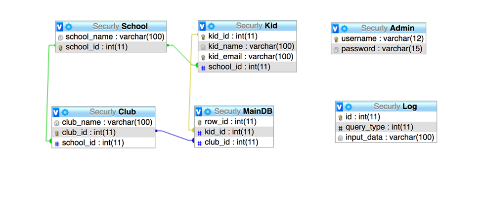

# District Admin Database to fetch student details

Used MySQL, PHP and XAMPP to build this website

## Basic Info & Features
A website that can be used by a District Admin to be able to view some information about kids, schools and clubs. Each school has some clubs and kids belonging to this school are members of these clubs. Features of the website include:
* Ability to login from the login page into the dashboard.
* Query 1: Given a kid’s email, return the school and clubs associated with the kid. A textbox to enter the email, a submit button, and the result is printed below.
* Query 2: Given a club name, return the school and kids associated with the club. A textbox to enter the club name, a submit button, and the result is printed below.
* Query 3: Given two kid’s email, print a yes if they are connected, print a no if they are not. Two textboxes to enter the email, a submit button, and the result is printed below. (If two kids belong to the same club, then they are connected. Connected is transitive. If the kid1 and kid2 are connected, and if the kid2 and kid3 are connected, then kid1 and kid3 are connected)
* An ability to select a query from the above list view and execute it again. The result is printed at the top of the table. A submit button is a part of the list view which is used to execute this query.
* Basic authentication for checking authenticity of email, required fields, and user authentication for username and password.
* Implemented session variable to prevent unauthorized access to a webpage.
* A logout page to log out of the website.

## DB Schema
Database schema used for this website is given below:

## Demo
A demo of the working prototype is given below:

